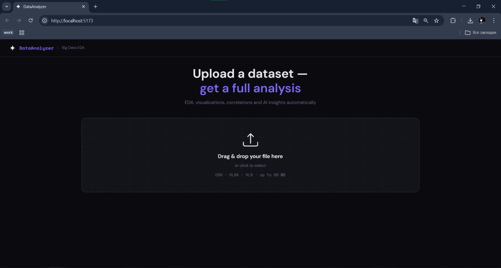
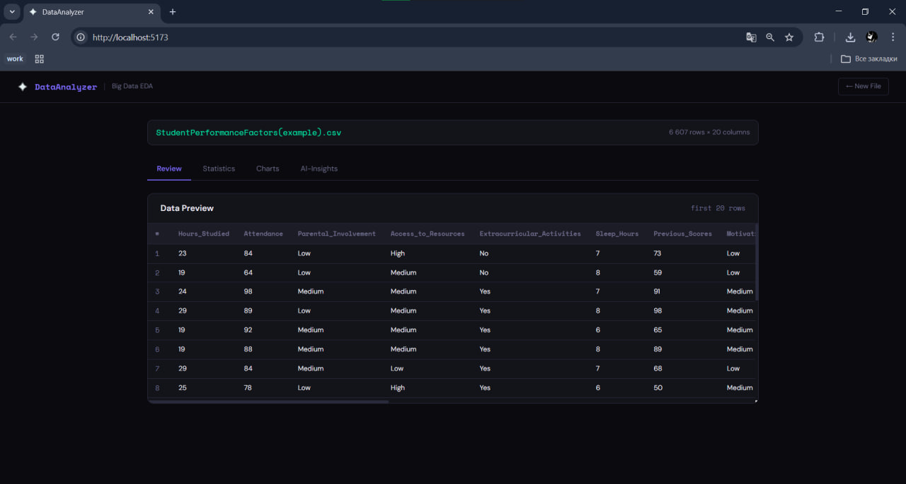
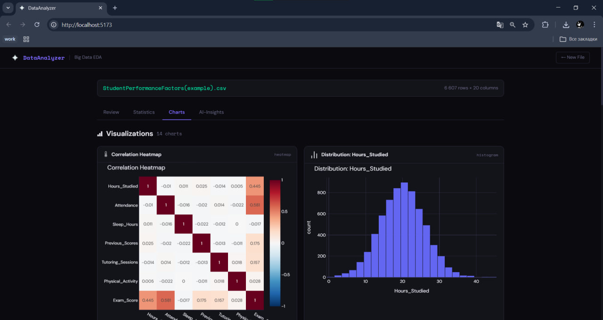

# DataAnalyzer — Automated Big Data Analysis

A full-stack web application for automated exploratory data analysis (EDA) of CSV and Excel datasets. Upload a file and instantly get visualizations, statistical insights, and AI-generated business recommendations.

---

## Features

- **Drag & drop** file upload (CSV, XLSX, up to 50MB)
- **Data preview** — first 20 rows with column types
- **Auto EDA** — missing value detection and filling, data type inference
- **14+ interactive charts** — correlation heatmap, histograms, bar charts, pie charts, scatter plots, box plots, time series
- **Descriptive statistics** — mean, std, min/max, percentiles
- **Top correlations** — ranked with visual bar indicators
- **AI-generated insights** — patterns, business recommendations, data quality notes (powered by Llama 3.3 70B via Groq)

---

## Tech Stack

| Layer | Technology |
|-------|-----------|
| Frontend | React 18 + Vite |
| Styling | CSS Variables + Google Fonts |
| Charts | Plotly.js |
| Backend | Python + FastAPI |
| Data | pandas, numpy |
| Visualizations | Plotly (server-side JSON) |
| AI Insights | Groq API (Llama 3.3 70B) |

---

##  Project Structure

```
FinalProject/
├── backend/
│   ├── main.py          # FastAPI app + endpoints
│   ├── analyzer.py      # pandas EDA logic
│   ├── charts.py        # Plotly chart generation
│   └── requirements.txt
├── frontend/
│   ├── src/
│   │   ├── components/
│   │   │   ├── UploadZone.jsx
│   │   │   ├── PreviewTable.jsx
│   │   │   ├── StatsSummary.jsx
│   │   │   ├── ChartGrid.jsx
│   │   │   └── InsightsPanel.jsx
│   │   ├── App.jsx
│   │   ├── main.jsx
│   │   └── index.css
│   └── vite.config.js
├── data/
│   └── StudentPerformanceFactors.csv
└── README.md
```

---

## Setup & Run

### Prerequisites
- Python 3.10+
- Node.js 18+
- Groq API key (free at [console.groq.com](https://console.groq.com))

---

### Backend

```bash
# 1. Go to backend folder
cd backend

# 2. Create and activate virtual environment
python -m venv venv
venv\Scripts\activate        # Windows
# source venv/bin/activate   # macOS/Linux

# 3. Install dependencies
pip install -r requirements.txt

# 4. Set Groq API key (required for AI insights)
$env:GROQ_API_KEY = "your_groq_api_key_here"   # Windows PowerShell
# export GROQ_API_KEY="your_groq_api_key_here" # macOS/Linux

# 5. Start the server
python -m uvicorn main:app --reload --port 8000
```

Backend runs at: `http://localhost:8000`

---

### Frontend

```bash
# 1. Go to frontend folder
cd frontend

# 2. Install dependencies
npm install

# 3. Start dev server
npm run dev
```

Frontend runs at: `http://localhost:5173`

---

## Sample Dataset

The repository includes `StudentPerformanceFactors.csv` — a dataset of 6,607 students with 20 features including study hours, attendance, sleep, parental involvement, and exam scores.

**Key findings from AI analysis:**
- Attendance has the strongest correlation with exam scores (r = 0.581)
- Hours studied is the second most influential factor (r = 0.445)
- Physical activity shows negligible impact on performance (r = 0.028)

---

## API Endpoints

| Method | Endpoint | Description |
|--------|----------|-------------|
| GET | `/` | Health check |
| POST | `/analyze` | Upload and analyze dataset |
| POST | `/insights` | Generate AI insights via Groq |

---

## Screenshots

### Upload Screen


### Data Preview


### Visualizations


### AI Insights


---

## yutori-mono

Built as a Final Project for Big Data Analysis course.
